Hw02\_Huiqing\_Fu
================
Huiqing Fu
3/1/2018

1) File Structure (10 pts)
--------------------------

2) Data (10 pts)
----------------

#### 2.1) Download the data

``` r
# curl -O https://raw.githubusercontent.com/ucb-stat133/stat133-spring-2018/master/data/stephen-curry.csv
# downloadgit     https://minhaskamal.github.io/DownGit/#/home
```

#### 2.2) Data Dictionary (10 pts)

3) Data Preparation (20 pts)
----------------------------

``` r
setwd("../data")
```

``` r
iguodala <- read.csv("../data/andre-iguodala.csv")
green<- read.csv("../data/draymond-green.csv")
curry<- read.csv("../data/stephen-curry.csv")
thompson<- read.csv("../data/klay-thompson.csv",stringsAsFactors = FALSE)
durant <- read.csv("../data/kevin-durant.csv",stringsAsFactors = FALSE)

# Add a column name to each imported data frame, that contains the name of the corresponding player
iguodala <- cbind(player="Andre Iguodala", iguodala )
green <- cbind(player="Draymond Green", green)
curry <- cbind(player="Stephen Curry", curry)
thompson <- cbind(player="Klay Thompson", thompson )
durant <- cbind(player="Kevin Durant", durant )
```

``` r
#Change the original values of shot_made_flag to more descriptive values: replace "n" with "missed shot", and "y" with "made shot". Hint: you can use logical subsetting for this operation (no need to use programming structures that we haven’t covered yet).
iguodala$shot_made_flag <- as.character(iguodala$shot_made_flag)
iguodala$shot_made_flag[iguodala$shot_made_flag == "n"] <- "missed shot"
iguodala$shot_made_flag[iguodala$shot_made_flag == "y"] <- "made shot"

green$shot_made_flag <- as.character(green$shot_made_flag)
green$shot_made_flag[green$shot_made_flag == "n"] <- "missed shot"
green$shot_made_flag[green$shot_made_flag == "y"] <- "made shot"

curry$shot_made_flag <- as.character(curry$shot_made_flag)
curry$shot_made_flag[curry$shot_made_flag == "n"] <- "missed shot"
curry$shot_made_flag[curry$shot_made_flag == "y"] <- "made shot"

thompson$shot_made_flag <- as.character(thompson$shot_made_flag)
thompson$shot_made_flag[thompson$shot_made_flag == "n"] <- "missed shot"
thompson$shot_made_flag[thompson$shot_made_flag == "y"] <- "made shot"

durant$shot_made_flag <- as.character(durant$shot_made_flag)
durant$shot_made_flag[durant$shot_made_flag == "n"] <- "missed shot"
durant$shot_made_flag[durant$shot_made_flag == "y"] <- "made shot"
```

``` r
#Add a column minute that contains the minute number where a shot occurred. For instance, if a shot took place during period = 1 and minutes_remaining = 8, then this should correspond to a value minute = 4. Likewise, if a shot took place during period = 4 and minutes_remaining = 2 then this should correspond to a value minute = 46. Hint: you can use logical subsetting for these operations (no need to use programming structures that we haven’t covered yet).
iguodala <- mutate(iguodala, minute=12*period-minutes_remaining )
green <- mutate(green, minute=12*period-minutes_remaining )
curry <- mutate(curry, minute=12*period-minutes_remaining )
thompson <- mutate(thompson, minute=12*period-minutes_remaining )
durant <- mutate(durant, minute=12*period-minutes_remaining )
```

``` r
# Use sink() to send the summary() output of each imported data frame into individuals text files: andre-iguodala-summary.txt, draymond-green-summary.txt, etc. During each sinking operation, the produced summaries should be sent to the output/folder using relative paths.

sink("../output/andre-iguodala-summary.txt")
summary(iguodala)
```

    ##             player                    team_name      game_date  
    ##  Andre Iguodala:371   Golden State Warriors:371   3/31/17 : 12  
    ##                                                   3/18/17 : 10  
    ##                                                   11/28/16:  9  
    ##                                                   2/13/17 :  9  
    ##                                                   2/2/17  :  9  
    ##                                                   3/28/17 :  9  
    ##                                                   (Other) :313  
    ##      season         period      minutes_remaining seconds_remaining
    ##  Min.   :2016   Min.   :1.000   Min.   : 0.000    Min.   : 0.00    
    ##  1st Qu.:2016   1st Qu.:2.000   1st Qu.: 1.000    1st Qu.:10.00    
    ##  Median :2016   Median :2.000   Median : 4.000    Median :27.00    
    ##  Mean   :2016   Mean   :2.518   Mean   : 4.582    Mean   :26.75    
    ##  3rd Qu.:2016   3rd Qu.:4.000   3rd Qu.: 8.000    3rd Qu.:41.00    
    ##  Max.   :2016   Max.   :4.000   Max.   :11.000    Max.   :59.00    
    ##                                                                    
    ##  shot_made_flag                 action_type           shot_type  
    ##  Length:371         Jump Shot         :179   2PT Field Goal:210  
    ##  Class :character   Pullup Jump shot  : 34   3PT Field Goal:161  
    ##  Mode  :character   Running Layup Shot: 19                       
    ##                     Running Dunk Shot : 18                       
    ##                     Layup Shot        : 17                       
    ##                     Cutting Dunk Shot : 16                       
    ##                     (Other)           : 88                       
    ##  shot_distance                     opponent         x         
    ##  Min.   : 0.00   Houston Rockets       : 30   Min.   :-245.0  
    ##  1st Qu.: 1.00   Los Angeles Clippers  : 29   1st Qu.: -65.5  
    ##  Median :18.00   Portland Trail Blazers: 22   Median :   0.0  
    ##  Mean   :13.69   Sacramento Kings      : 22   Mean   :   3.9  
    ##  3rd Qu.:24.00   Oklahoma City Thunder : 21   3rd Qu.: 101.5  
    ##  Max.   :49.00   Memphis Grizzlies     : 18   Max.   : 238.0  
    ##                  (Other)               :229                   
    ##        y              minute     
    ##  Min.   :-31.00   Min.   : 4.00  
    ##  1st Qu.:  2.00   1st Qu.:14.00  
    ##  Median : 23.00   Median :24.00  
    ##  Mean   : 73.62   Mean   :25.63  
    ##  3rd Qu.:150.00   3rd Qu.:37.00  
    ##  Max.   :497.00   Max.   :48.00  
    ## 

``` r
sink()

sink("../output/klay-thompson-summary.txt")
summary(thompson)
```

    ##            player      team_name          game_date             season    
    ##  Klay Thompson:1220   Length:1220        Length:1220        Min.   :2016  
    ##                       Class :character   Class :character   1st Qu.:2016  
    ##                       Mode  :character   Mode  :character   Median :2016  
    ##                                                             Mean   :2016  
    ##                                                             3rd Qu.:2016  
    ##                                                             Max.   :2016  
    ##      period      minutes_remaining seconds_remaining shot_made_flag    
    ##  Min.   :1.000   Min.   : 0.000    Min.   : 0.00     Length:1220       
    ##  1st Qu.:1.000   1st Qu.: 4.000    1st Qu.:14.00     Class :character  
    ##  Median :2.000   Median : 7.000    Median :29.50     Mode  :character  
    ##  Mean   :2.369   Mean   : 6.511    Mean   :29.19                       
    ##  3rd Qu.:3.000   3rd Qu.: 9.000    3rd Qu.:44.00                       
    ##  Max.   :4.000   Max.   :11.000    Max.   :59.00                       
    ##  action_type         shot_type         shot_distance     opponent        
    ##  Length:1220        Length:1220        Min.   : 0.00   Length:1220       
    ##  Class :character   Class :character   1st Qu.:12.00   Class :character  
    ##  Mode  :character   Mode  :character   Median :20.00   Mode  :character  
    ##                                        Mean   :17.16                     
    ##                                        3rd Qu.:25.00                     
    ##                                        Max.   :32.00                     
    ##        x                 y             minute     
    ##  Min.   :-248.00   Min.   :-29.0   Min.   : 1.00  
    ##  1st Qu.: -68.00   1st Qu.: 16.0   1st Qu.: 9.00  
    ##  Median :  14.50   Median :105.0   Median :23.00  
    ##  Mean   :  24.89   Mean   :106.0   Mean   :21.91  
    ##  3rd Qu.: 145.25   3rd Qu.:179.2   3rd Qu.:32.00  
    ##  Max.   : 246.00   Max.   :311.0   Max.   :48.00

``` r
sink()

sink("../output/draymond-green-summary.txt")
summary(green)
```

    ##             player                    team_name      game_date  
    ##  Draymond Green:578   Golden State Warriors:578   3/24/17 : 17  
    ##                                                   3/28/17 : 15  
    ##                                                   10/25/16: 14  
    ##                                                   12/1/16 : 14  
    ##                                                   11/16/16: 13  
    ##                                                   2/4/17  : 13  
    ##                                                   (Other) :492  
    ##      season         period      minutes_remaining seconds_remaining
    ##  Min.   :2016   Min.   :1.000   Min.   : 0.000    Min.   : 0.00    
    ##  1st Qu.:2016   1st Qu.:1.000   1st Qu.: 2.000    1st Qu.:15.25    
    ##  Median :2016   Median :2.000   Median : 6.000    Median :31.00    
    ##  Mean   :2016   Mean   :2.327   Mean   : 5.536    Mean   :29.59    
    ##  3rd Qu.:2016   3rd Qu.:3.000   3rd Qu.: 9.000    3rd Qu.:44.00    
    ##  Max.   :2016   Max.   :4.000   Max.   :11.000    Max.   :59.00    
    ##                                                                    
    ##  shot_made_flag                 action_type           shot_type  
    ##  Length:578         Jump Shot         :240   2PT Field Goal:346  
    ##  Class :character   Layup Shot        : 59   3PT Field Goal:232  
    ##  Mode  :character   Pullup Jump shot  : 44                       
    ##                     Driving Layup Shot: 33                       
    ##                     Tip Layup Shot    : 26                       
    ##                     Cutting Dunk Shot : 22                       
    ##                     (Other)           :154                       
    ##  shot_distance                    opponent         x          
    ##  Min.   : 0.00   Houston Rockets      : 52   Min.   :-248.00  
    ##  1st Qu.: 1.00   Sacramento Kings     : 42   1st Qu.: -27.00  
    ##  Median : 6.00   New Orleans Pelicans : 29   Median :   0.00  
    ##  Mean   :12.17   Oklahoma City Thunder: 29   Mean   :  -7.17  
    ##  3rd Qu.:25.00   Dallas Mavericks     : 27   3rd Qu.:  18.75  
    ##  Max.   :55.00   Memphis Grizzlies    : 26   Max.   : 240.00  
    ##                  (Other)              :373                    
    ##        y             minute     
    ##  Min.   :-31.0   Min.   : 1.00  
    ##  1st Qu.:  8.0   1st Qu.:10.00  
    ##  Median : 36.0   Median :23.00  
    ##  Mean   :100.6   Mean   :22.39  
    ##  3rd Qu.:217.0   3rd Qu.:33.00  
    ##  Max.   :535.0   Max.   :48.00  
    ## 

``` r
sink()

sink("../output/stephen-curry-summary.txt")
summary(curry)
```

    ##            player                     team_name      game_date   
    ##  Stephen Curry:1250   Golden State Warriors:1250   3/2/17 :  27  
    ##                                                    11/7/16:  26  
    ##                                                    1/4/17 :  25  
    ##                                                    1/6/17 :  24  
    ##                                                    3/5/17 :  24  
    ##                                                    1/25/17:  23  
    ##                                                    (Other):1101  
    ##      season         period      minutes_remaining seconds_remaining
    ##  Min.   :2016   Min.   :1.000   Min.   : 0.000    Min.   : 0.00    
    ##  1st Qu.:2016   1st Qu.:1.000   1st Qu.: 1.000    1st Qu.:13.00    
    ##  Median :2016   Median :2.000   Median : 4.000    Median :29.00    
    ##  Mean   :2016   Mean   :2.305   Mean   : 4.221    Mean   :28.53    
    ##  3rd Qu.:2016   3rd Qu.:3.000   3rd Qu.: 7.000    3rd Qu.:44.00    
    ##  Max.   :2016   Max.   :4.000   Max.   :11.000    Max.   :59.00    
    ##                                                                    
    ##  shot_made_flag                  action_type           shot_type  
    ##  Length:1250        Jump Shot          :596   2PT Field Goal:563  
    ##  Class :character   Pullup Jump shot   :158   3PT Field Goal:687  
    ##  Mode  :character   Step Back Jump shot: 75                       
    ##                     Layup Shot         : 60                       
    ##                     Driving Layup Shot : 58                       
    ##                     Floating Jump shot : 36                       
    ##                     (Other)            :267                       
    ##  shot_distance                    opponent         x           
    ##  Min.   : 0.00   Los Angeles Clippers : 78   Min.   :-246.000  
    ##  1st Qu.: 5.00   Houston Rockets      : 75   1st Qu.: -96.500  
    ##  Median :23.00   Sacramento Kings     : 71   Median :   0.500  
    ##  Mean   :17.99   Memphis Grizzlies    : 69   Mean   :  -3.642  
    ##  3rd Qu.:26.00   Oklahoma City Thunder: 69   3rd Qu.:  91.000  
    ##  Max.   :71.00   New Orleans Pelicans : 68   Max.   : 240.000  
    ##                  (Other)              :820                     
    ##        y             minute     
    ##  Min.   :-36.0   Min.   : 1.00  
    ##  1st Qu.: 18.0   1st Qu.:10.25  
    ##  Median :144.0   Median :24.00  
    ##  Mean   :135.4   Mean   :23.44  
    ##  3rd Qu.:228.0   3rd Qu.:34.00  
    ##  Max.   :717.0   Max.   :48.00  
    ## 

``` r
sink()

sink("../output/kevin-durant-summary.txt")
summary(durant)
```

    ##           player     team_name          game_date             season    
    ##  Kevin Durant:915   Length:915         Length:915         Min.   :2016  
    ##                     Class :character   Class :character   1st Qu.:2016  
    ##                     Mode  :character   Mode  :character   Median :2016  
    ##                                                           Mean   :2016  
    ##                                                           3rd Qu.:2016  
    ##                                                           Max.   :2016  
    ##      period     minutes_remaining seconds_remaining shot_made_flag    
    ##  Min.   :1.00   Min.   : 0.000    Min.   : 0.00     Length:915        
    ##  1st Qu.:1.00   1st Qu.: 2.000    1st Qu.:13.00     Class :character  
    ##  Median :2.00   Median : 6.000    Median :27.00     Mode  :character  
    ##  Mean   :2.34   Mean   : 5.833    Mean   :28.02                       
    ##  3rd Qu.:3.00   3rd Qu.: 9.000    3rd Qu.:43.00                       
    ##  Max.   :4.00   Max.   :11.000    Max.   :59.00                       
    ##  action_type         shot_type         shot_distance     opponent        
    ##  Length:915         Length:915         Min.   : 0.00   Length:915        
    ##  Class :character   Class :character   1st Qu.: 2.00   Class :character  
    ##  Mode  :character   Mode  :character   Median :14.00   Mode  :character  
    ##                                        Mean   :13.12                     
    ##                                        3rd Qu.:24.00                     
    ##                                        Max.   :58.00                     
    ##        x                 y              minute     
    ##  Min.   :-246.00   Min.   :-39.00   Min.   : 1.00  
    ##  1st Qu.: -29.00   1st Qu.: 11.00   1st Qu.:11.00  
    ##  Median :   0.00   Median : 80.00   Median :23.00  
    ##  Mean   :  11.43   Mean   : 98.54   Mean   :22.25  
    ##  3rd Qu.:  73.50   3rd Qu.:173.50   3rd Qu.:32.00  
    ##  Max.   : 240.00   Max.   :572.00   Max.   :48.00

``` r
sink()
```

``` r
# Use the row binding function rbind() to stack the tables into one single data frame (or tibble object).
dat <- rbind(iguodala, thompson, green, curry, durant)

# Export (i.e. write) the assembled table as a CSV file shots-data.csv inside the folder data/. Use a relative path for this operation.
write.csv(dat, file = "../data/shots-data.csv")

# Use sink() to send the summary() output of the assembled table. Send this output to a text file named shots-data-summary.txt inside the output/ folder. Use a relative path when exporting the R output.
sink("../output/shots-data-summary.txt")
summary(dat)
```

    ##             player                     team_name       game_date   
    ##  Andre Iguodala: 371   Golden State Warriors:4334   10/28/16:  76  
    ##  Klay Thompson :1220                                12/13/16:  75  
    ##  Draymond Green: 578                                11/7/16 :  74  
    ##  Stephen Curry :1250                                1/20/17 :  73  
    ##  Kevin Durant  : 915                                11/16/16:  72  
    ##                                                     11/18/16:  72  
    ##                                                     (Other) :3892  
    ##      season         period      minutes_remaining seconds_remaining
    ##  Min.   :2016   Min.   :1.000   Min.   : 0.000    Min.   : 0.00    
    ##  1st Qu.:2016   1st Qu.:1.000   1st Qu.: 2.000    1st Qu.:13.00    
    ##  Median :2016   Median :2.000   Median : 5.000    Median :29.00    
    ##  Mean   :2016   Mean   :2.351   Mean   : 5.412    Mean   :28.60    
    ##  3rd Qu.:2016   3rd Qu.:3.000   3rd Qu.: 8.000    3rd Qu.:43.75    
    ##  Max.   :2016   Max.   :4.000   Max.   :11.000    Max.   :59.00    
    ##                                                                    
    ##  shot_made_flag                  action_type            shot_type   
    ##  Length:4334        Jump Shot          :2051   2PT Field Goal:2402  
    ##  Class :character   Pullup Jump shot   : 521   3PT Field Goal:1932  
    ##  Mode  :character   Layup Shot         : 215                        
    ##                     Driving Layup Shot : 160                        
    ##                     Step Back Jump shot: 133                        
    ##                     Running Layup Shot : 115                        
    ##                     (Other)            :1139                        
    ##  shot_distance                     opponent          x           
    ##  Min.   : 0.00   Houston Rockets       : 271   Min.   :-248.000  
    ##  1st Qu.: 2.25   Sacramento Kings      : 249   1st Qu.: -56.000  
    ##  Median :19.00   Los Angeles Clippers  : 246   Median :   1.000  
    ##  Mean   :15.58   Oklahoma City Thunder : 240   Mean   :   7.746  
    ##  3rd Qu.:25.00   Portland Trail Blazers: 238   3rd Qu.:  95.500  
    ##  Max.   :71.00   Memphis Grizzlies     : 225   Max.   : 246.000  
    ##                  (Other)               :2865                     
    ##        y             minute    
    ##  Min.   :-39.0   Min.   : 1.0  
    ##  1st Qu.: 13.0   1st Qu.:11.0  
    ##  Median : 95.0   Median :23.0  
    ##  Mean   :109.4   Mean   :22.8  
    ##  3rd Qu.:198.0   3rd Qu.:33.0  
    ##  Max.   :717.0   Max.   :48.0  
    ## 

``` r
sink()
```

4) Shot Charts (20 pts)
-----------------------

#### 4.1) Shot charts of each player (10 pts)

``` {r
# scatterplot
thompson_scatterplot <- ggplot(data = thompson) +
    geom_point(aes(x = x, y = y, color = shot_made_flag))
thompson_scatterplot
```

``` r
#The JPG file with this image is available in the course github repository, inside the folder images/. You need to import the file nba-court.jpg to the images/ folder of your HW directory.
# cd ../images
#curl -O https://raw.githubusercontent.com/ucb-stat133/stat133-spring-2018/master/data/nba-court.jpg

# court image (to be used as background of plot)
court_file <- "../images/nba-court.jpg"
# create raste object

court_image <- rasterGrob(
  readJPEG(court_file),
  width = unit(1, "npc"),
  height = unit(1, "npc"))

# shot chart with court background
thompson_shot_chart <- ggplot(data = thompson) +
    annotation_custom(court_image, -250, 250, -50, 420) +
    geom_point(aes(x = x, y = y, color = shot_made_flag)) +
    ylim(-50, 420) +
    ggtitle('Shot Chart: Klay Thompson (2016 season)') +
    theme_minimal()
thompson_shot_chart 
```

 \#\#\#\#4.1) Shot charts of each player (10 pts) Create shot charts (with court backgrounds) for each player, and save the plots in PDF format, with dimensions width = 6.5 and height = 5 inches, inside the folder images/: • andre-iguodala-shot-chart.pdf • draymond-green-shot-chart.pdf • kevin-durant-shot-chart.pdf • klay-thompson-shot-chart.pdf • stephen-curry-shot-chart.pdf

``` r
#court_file <- "../images/nba-court.jpg"
court_image <- rasterGrob(readJPEG("../images/nba-court.jpg"),
                          width = unit(1,"npc"),
                          height = unit(1,"npc")
                    
)
iguodala_shot_chart <- ggplot(data = iguodala, aes(x = x, y =y))+
  annotation_custom(court_image, -250,250, -50, 420)+
  geom_point(aes(color=shot_made_flag))+
  ylim(-50,420)+
  ggtitle('Shot Chart: Andre Iguodala (2016 Season)')+
  theme_minimal()
 iguodala_shot_chart 
```

    ## Warning: Removed 2 rows containing missing values (geom_point).

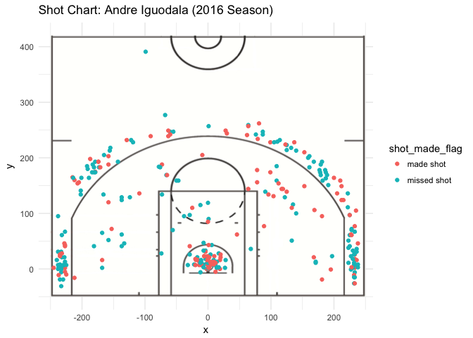

``` r
court_file <- "../images/nba-court.jpg"
court_image <- rasterGrob(
  readJPEG(court_file),
  width = unit(1, "npc"),
  height = unit(1, "npc")) 
green_shot_chart <- ggplot(data = green, aes(x = x, y = y, color = shot_made_flag))+
  annotation_custom(court_image,  -250, 250, -50,420)+
  ylim(-50,420)+
  geom_point()+
  ggtitle('Shot Chart: Draymond Green (2016 Season)')+
  theme_minimal()
green_shot_chart
```

    ## Warning: Removed 1 rows containing missing values (geom_point).

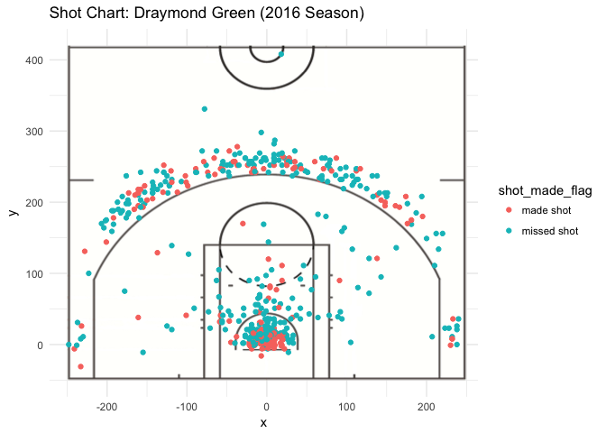

``` r
curry_shot_chart <- ggplot(data = curry, aes(x = x, y = y, color = shot_made_flag))+
  annotation_custom(court_image, -250,250,-50,420)+
  geom_point()+
  ylim(-50,420)+
  ggtitle("Shot Chart: Stephen Curry (2016 Season)")+
  theme_minimal()
curry_shot_chart
```

    ## Warning: Removed 17 rows containing missing values (geom_point).

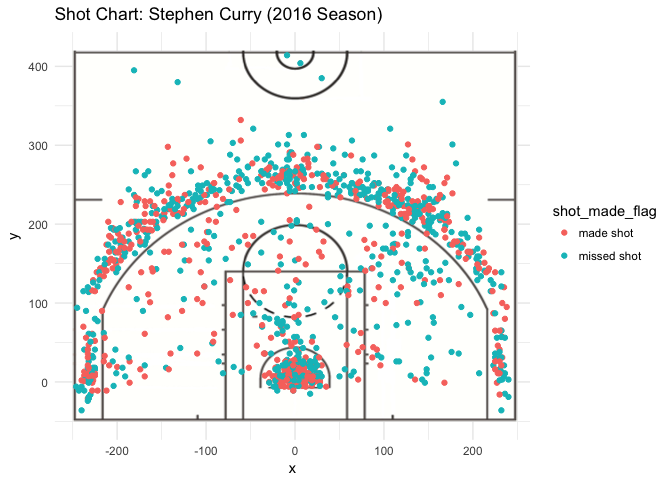

``` r
durant_shot_chart <- ggplot(data = durant, aes(x = x, y = y, color = shot_made_flag))+
  annotation_custom(court_image, -250, 250, -50, 420)+
  geom_point()+
  ylim(-50,420)+
  ggtitle("Shot Chart: Kevin Durant (2016 Season)")+
  theme_minimal()
durant_shot_chart
```

    ## Warning: Removed 2 rows containing missing values (geom_point).

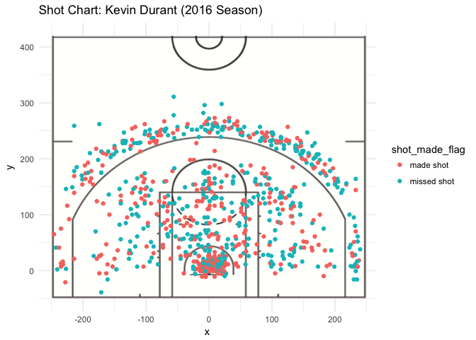

``` r
thompson_shot_chart <- ggplot(data = thompson, aes(x = x, y = y, color = shot_made_flag))+
  annotation_custom(court_image, -250, 250, -50, 420)+
  geom_point()+
  ylim(-50,420)+
  ggtitle("Shot Chart: Klay Thompson (2016 Season)")+
  theme_minimal()
thompson_shot_chart
```

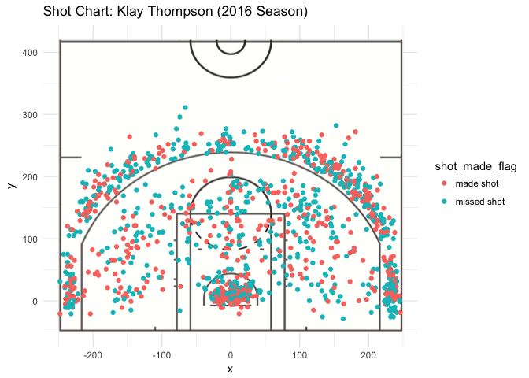

``` r
pdf(file = "../images/andre-iguodala-shot-chart.pdf", width = 7, height = 5)
iguodala_shot_chart
```

    ## Warning: Removed 2 rows containing missing values (geom_point).

``` r
dev.off()
```

    ## quartz_off_screen 
    ##                 2

``` r
pdf(file = "../images/draymond-green-shot-chart.pdf", width = 7, height = 5)
green_shot_chart
```

    ## Warning: Removed 1 rows containing missing values (geom_point).

``` r
dev.off()
```

    ## quartz_off_screen 
    ##                 2

``` r
pdf(file = "../images/kevin-durant-shot-chart.pdf", width = 7, height = 5)
durant_shot_chart
```

    ## Warning: Removed 2 rows containing missing values (geom_point).

``` r
dev.off()
```

    ## quartz_off_screen 
    ##                 2

``` r
pdf(file = "../images/klay-thompson-shot-chart.pdf", width = 7, height = 5)
thompson_shot_chart
dev.off()
```

    ## quartz_off_screen 
    ##                 2

``` r
pdf(file = "../images/stephen-curry-shot-chart.pdf", width = 7, height = 5)
curry_shot_chart
```

    ## Warning: Removed 17 rows containing missing values (geom_point).

``` r
dev.off()
```

    ## quartz_off_screen 
    ##                 2

#### 4.2) Facetted Shot Chart (10 pts)

Create one graph, using facetting, to show all the shot charts in one image, similar to the one below. Save this image in PDF format as gsw-shot-charts.pdf, inside the folder images/. Specify image dimensions width = 8 and height = 7 inches.

``` r
gsw_shot_charts<- ggplot(data = dat, aes(x = x, y =y, color = shot_made_flag))+
         annotation_custom(court_image, -250, 250, -50, 420)+
  geom_point(size = 0.7)+
  ylim(-50, 420)+
  facet_wrap(~player)+
  ggtitle("Shot Charts: GSW (2016 season)")+
  theme_minimal()+
  theme(legend.position="top")+
  theme(legend.title = element_blank())+
  #theme(legend.position = c(0.8, 0.3))+
   theme(legend.text = element_text(size=8))
gsw_shot_charts
```

    ## Warning: Removed 22 rows containing missing values (geom_point).

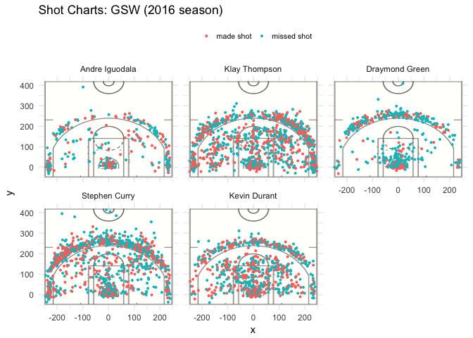

``` r
pdf("../images/gsw-shot-charts.pdf", width = 8, height = 7)
gsw_shot_charts
```

    ## Warning: Removed 22 rows containing missing values (geom_point).

``` r
dev.off()
```

    ## quartz_off_screen 
    ##                 2

5) Summary Tables (20 pts)
--------------------------

#### 5.1) Total Shots by Player (10 pts)

``` r
# Total number of shots (2PT and 3PT, both made and missed) by player, arranged in descending order.
dat_total <- dat %>% 
  group_by(player)%>%
  summarise(count=n())%>%
  arrange(desc(count))
colnames(dat_total)[colnames(dat_total)=="count"] <- "total"
dat_total
```

    ## # A tibble: 5 x 2
    ##   player         total
    ##   <fct>          <int>
    ## 1 Stephen Curry   1250
    ## 2 Klay Thompson   1220
    ## 3 Kevin Durant     915
    ## 4 Draymond Green   578
    ## 5 Andre Iguodala   371

#### 5.2) Effective Shooting Percentage (10 pts)

``` r
# Effective Shooting % by Player, arranged in descending order.
dat_total <- dat %>%
  group_by(player)%>%
  summarise(count=n())
colnames(dat_total)[colnames(dat_total)=="count"] <- "total"
 
effective_shot <- dat%>%
  group_by(player,shot_made_flag)%>%
  summarise(count=n())%>%
  filter(shot_made_flag=="made shot")
colnames(effective_shot)[colnames(effective_shot)=="count"] <- "made"

EF_ST <- merge(dat_total, effective_shot, by = "player") %>%
  mutate(perc_made = made/total)%>%
  select(player, total, made,perc_made)%>%
  arrange(desc(perc_made))
EF_ST
```

    ##           player total made perc_made
    ## 1   Kevin Durant   915  495 0.5409836
    ## 2 Andre Iguodala   371  192 0.5175202
    ## 3  Klay Thompson  1220  575 0.4713115
    ## 4  Stephen Curry  1250  584 0.4672000
    ## 5 Draymond Green   578  245 0.4238754

``` r
#2PT Effective Shooting % by Player:arranged in descending order by percentage.
dat_total_2PT <- dat %>%
  select(player, shot_made_flag, shot_type) %>%
  filter(shot_type =="2PT Field Goal") %>%
  group_by(player) %>%
  summarise(count=n())
colnames(dat_total_2PT)[colnames(dat_total_2PT)=="count"] <- "total"

effective_shot_2PT <- dat %>%
  select(player, shot_made_flag, shot_type) %>%
  filter(shot_type=="2PT Field Goal"&shot_made_flag=="made shot")%>%
  group_by(player,shot_made_flag, shot_type)%>%
    summarise(count=n())
  colnames(effective_shot_2PT)[colnames(effective_shot_2PT)=="count"] <- "made"

EF_ST_2PT <- 
  merge(dat_total_2PT, effective_shot_2PT, by = "player")%>%
    mutate(perc_made_2PT = made/total)%>%
    arrange(desc(perc_made_2PT))
EF_ST_2PT
```

    ##           player total shot_made_flag      shot_type made perc_made_2PT
    ## 1 Andre Iguodala   210      made shot 2PT Field Goal  134     0.6380952
    ## 2   Kevin Durant   643      made shot 2PT Field Goal  390     0.6065319
    ## 3  Stephen Curry   563      made shot 2PT Field Goal  304     0.5399645
    ## 4  Klay Thompson   640      made shot 2PT Field Goal  329     0.5140625
    ## 5 Draymond Green   346      made shot 2PT Field Goal  171     0.4942197

``` r
#3PT Effective Shooting % by Player:arranged in descending order by percentage.
dat_total_3PT <- dat %>%
  select(player, shot_made_flag, shot_type) %>%
  filter(shot_type =="3PT Field Goal") %>%
  group_by(player) %>%
  summarise(count=n())
colnames(dat_total_3PT)[colnames(dat_total_3PT)=="count"] <- "total"

effective_shot_3PT <- 
  dat %>%
  select(player, shot_made_flag, shot_type) %>%
    filter(shot_made_flag=="made shot"&shot_type=="3PT Field Goal")%>%
    group_by(player,shot_type, shot_made_flag)%>%
    summarise(count=n())
  colnames(effective_shot_3PT)[colnames(effective_shot_3PT)=="count"] <- "made"

EF_ST_3PT <- 
  merge(dat_total_3PT, effective_shot_3PT, by = "player")%>%
    mutate(perc_made_3PT = made/total)%>%
    arrange(desc(perc_made_3PT))
EF_ST_3PT
```

    ##           player total      shot_type shot_made_flag made perc_made_3PT
    ## 1  Klay Thompson   580 3PT Field Goal      made shot  246     0.4241379
    ## 2  Stephen Curry   687 3PT Field Goal      made shot  280     0.4075691
    ## 3   Kevin Durant   272 3PT Field Goal      made shot  105     0.3860294
    ## 4 Andre Iguodala   161 3PT Field Goal      made shot   58     0.3602484
    ## 5 Draymond Green   232 3PT Field Goal      made shot   74     0.3189655

6) Shooting Distance (20 pts)
-----------------------------

#### 6.1) dplyr table (10 pts)

``` r
#More precisely, use dplyr operations to obtain a tibble with two columns: shot_distance and made_shot_prop. The first row of the tibble should contain the value of distance = 0 ft, and the associated proportion of made shots (of all the five analyzed players). The second row should contain the value of distance = 1 ft, and the corresponding proportion of made shots; and so on.
Total_shot_distance <- dat%>%
  select(shot_distance,shot_made_flag)%>%
  group_by(shot_distance)%>%
  summarise(count=n())
colnames(Total_shot_distance)[colnames(Total_shot_distance)=="count"] <- "total"

made_shot <- 
  dat%>%
  select(shot_distance,shot_made_flag)%>%
  filter(shot_made_flag=="made shot")%>%
  group_by(shot_distance)%>%
  summarise(count=n())
  colnames(made_shot)[colnames(made_shot)=="count"] <- "made"
  
Shooting_Distance <- merge(Total_shot_distance, made_shot, by = "shot_distance")%>%
  mutate(made_shot_prop = made/total)%>%
  select(shot_distance, made_shot_prop)
Shooting_Distance
```

    ##    shot_distance made_shot_prop
    ## 1              0      0.8410758
    ## 2              1      0.6683673
    ## 3              2      0.5335689
    ## 4              3      0.3734940
    ## 5              4      0.4107143
    ## 6              5      0.2857143
    ## 7              6      0.3958333
    ## 8              7      0.3953488
    ## 9              8      0.4634146
    ## 10             9      0.3207547
    ## 11            10      0.4642857
    ## 12            11      0.3921569
    ## 13            12      0.5000000
    ## 14            13      0.3692308
    ## 15            14      0.3797468
    ## 16            15      0.4864865
    ## 17            16      0.5327103
    ## 18            17      0.3775510
    ## 19            18      0.5277778
    ## 20            19      0.4077670
    ## 21            20      0.4492754
    ## 22            21      0.5106383
    ## 23            22      0.4901961
    ## 24            23      0.4166667
    ## 25            24      0.4152047
    ## 26            25      0.3857404
    ## 27            26      0.3861893
    ## 28            27      0.4580153
    ## 29            28      0.3088235
    ## 30            29      0.4054054
    ## 31            30      0.5000000
    ## 32            31      0.2666667
    ## 33            32      0.4000000
    ## 34            33      0.4000000
    ## 35            51      1.0000000

#### 6.2) ggplot (10 pts)

``` r
#With the tibble created in 6.1), use ggplot() to make a scatterplot with the variables shot_distance and made_shot_prop. Use the x-axis for the shot distance, and the y-axis for the proportion of made shots.
ggplot(data = Shooting_Distance, aes(x = shot_distance, y = made_shot_prop))+
  geom_point(aes(color=shot_distance))
```

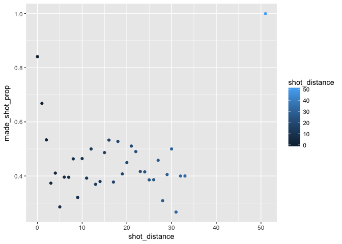

• What do you observe? Between 0-5 feet,it seems there is a linear relationship between shot\_distance and made\_shot\_prop. However, between 5-35 feet, the points are bouncing around, it is a very weak correlation. At distance = 50, there is a point which is clearly a outlier. Therefore, we have no a clear conclusion for NBA players that the shorter the shooting distance, the higher the chance to successfully make a shot.

• Can you confirm that the shorter the distance, the more effective the shots? Based on the data, we cannot have such a conclusion for NBA players.

• Can you guesstimate a distance threshold beyond which the chance of making a successful shot is basically null? Beyond 5 feet, the chance of making a successful shot is basically null.

• What distances tend to have a percentage (of making a shot) of 50% or more? 15-22 feet.

7) Total number of shots by minute of occurrence (10 pts)
---------------------------------------------------------

``` r
#total number of shots (made and missed),minute of occurrence.
#• stephen-curry
shots_curry <- curry %>%
  select(player, minute)%>%
  group_by(player,minute)%>%
  summarise(count=n())%>%
  ggplot(aes(x = minute, y = count),color='blue' )+
  geom_point()+
  ylab("total number of shots")+
  scale_x_continuous(limits = c(0,48), breaks = seq(from=2, to =48, by = 2))+
  scale_y_continuous(limits = c(0,70))+
  geom_path()+
  geom_rect(alpha= 0.005,aes(x=minute, y =count,xmin = 0, xmax=12, ymin=-Inf, ymax=Inf))+
geom_rect(alpha=0.005,aes(x=minute, y =count,xmin = 24, xmax=36, ymin=-Inf, ymax=Inf))+
  theme_minimal()+
  ggtitle("Stephen Curry: Total Number of Shots")
```

    ## Warning: Ignoring unknown aesthetics: x, y

    ## Warning: Ignoring unknown aesthetics: x, y

``` r
shots_curry
```

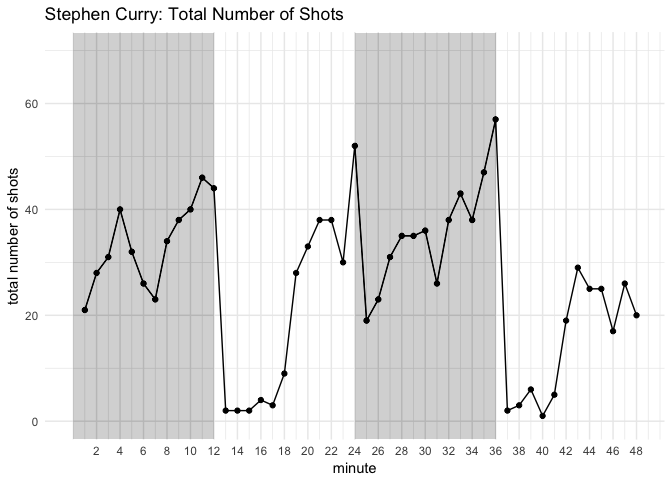

``` r
#• andre-iguodala
shots_iguodala <- iguodala %>%
  select(player, minute)%>%
  group_by(player,minute)%>%
  summarise(count=n())%>%
  ggplot(aes(x = minute, y = count))+
  geom_point()+
  ylab("total number of shots")+
  scale_x_discrete(limits = c(0,48), breaks = seq(from=2, to =48, by = 2))+
  scale_y_discrete(limits = c(0,70))+
  geom_path()+
  geom_rect(alpha= 0.005,fill="blue",aes(x=minute, y =count,xmin = 0, xmax=12, ymin=-Inf, ymax=Inf))+
  geom_rect(alpha=0.005,fill="blue",aes(x=minute, y =count,xmin = 24, xmax=36, ymin=-Inf, ymax=Inf))+
  theme_minimal()+
  ggtitle("Andre Iguodala: Total Number of Shots")
```

    ## Warning: Ignoring unknown aesthetics: x, y

    ## Warning: Ignoring unknown aesthetics: x, y

``` r
shots_iguodala
```

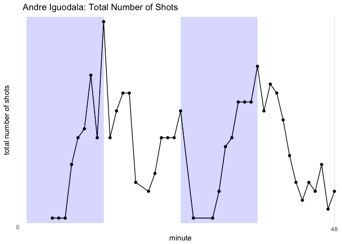

``` r
#• draymond-green
shots_green <- green %>%
  select(player, minute)%>%
  group_by(player,minute)%>%
  summarise(count=n())%>%
  ggplot(aes(x = minute, y = count) )+
  geom_point(color='maroon')+
  ylab("total number of shots")+
  scale_x_discrete(limits = c(0,48), breaks = seq(from=2, to =48, by = 2))+
  scale_y_discrete(limits = c(0,70))+
  geom_path(color='coral1')+
  geom_rect(alpha= 0.005,fill="yellowgreen",aes(x=minute, y =count,xmin = 0, xmax=12, ymin=-Inf, ymax=Inf))+
geom_rect(alpha=0.005,fill="yellowgreen",aes(x=minute, y =count,xmin = 24, xmax=36, ymin=-Inf, ymax=Inf))+
  theme_minimal()+
  ggtitle("Draymond Green: Total Number of Shots")
```

    ## Warning: Ignoring unknown aesthetics: x, y

    ## Warning: Ignoring unknown aesthetics: x, y

``` r
shots_green
```

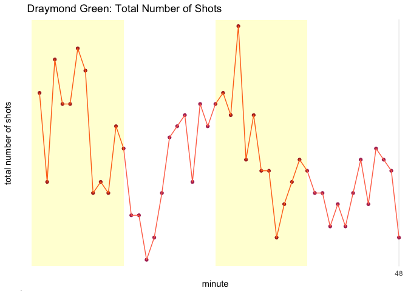

``` r
#• kevin-durant
shots_durant <- durant %>%
  select(player, minute)%>%
  group_by(player,minute)%>%
  summarise(count=n())%>%
  ggplot(aes(x = minute, y = count))+
  geom_point(color="deepskyblue3")+
  ylab("total number of shots")+
  scale_x_continuous(limits = c(0,48), breaks = seq(from=2, to =48, by = 2))+
  scale_y_continuous(limits = c(0,70))+
  geom_path(color="deepskyblue2")+
  geom_rect(alpha= 0.005,aes(x=minute, y =count),xmin = 0, xmax=12, ymin=-Inf, ymax=Inf)+
geom_rect(alpha=0.005,aes(x=minute, y =count),xmin = 24, xmax=36, ymin=-Inf, ymax=Inf)+
  theme_minimal()+
  ggtitle("Kevin Durant: Total Number of Shots")
```

    ## Warning: Ignoring unknown aesthetics: x, y

    ## Warning: Ignoring unknown aesthetics: x, y

``` r
shots_durant
```

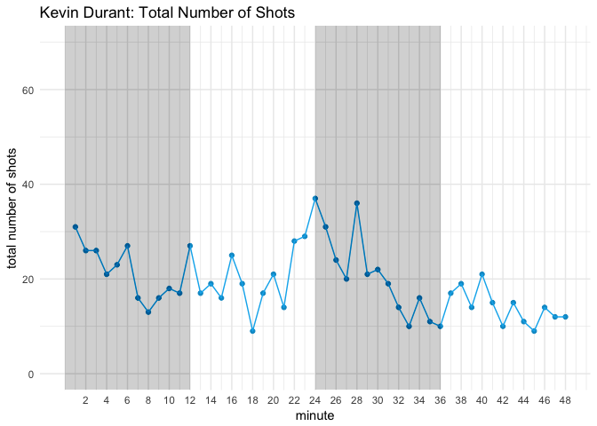

``` r
#• klay-thompson
shots_thompson <- thompson %>%
  select(player, minute)%>%
  group_by(player,minute)%>%
  summarise(count=n())%>%
  ggplot(aes(x = minute, y = count),color='blue' )+
  geom_point(color="yellowgreen")+
  ylab("total number of shots")+
  scale_x_continuous(limits = c(0,48), breaks = seq(from=2, to =48, by = 2))+
  scale_y_continuous(limits = c(0,70))+
  geom_path(color="green")+
  geom_rect(alpha= 0.005,aes(x=minute, y =count),xmin = 0, xmax=12, ymin=-Inf, ymax=Inf)+
geom_rect(alpha=0.005,aes(x=minute, y =count),xmin = 24, xmax=36, ymin=-Inf, ymax=Inf)+
  theme_minimal()+
  ggtitle("Klay Thompson: Total Number of Shots")
```

    ## Warning: Ignoring unknown aesthetics: x, y

    ## Warning: Ignoring unknown aesthetics: x, y

``` r
shots_thompson
```

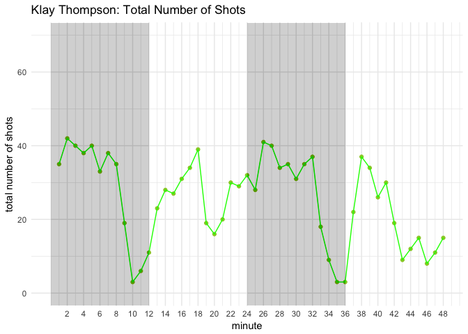

``` r
#• Total Number of Shots (made and missed),minute of occurrence

 dat %>%
  select(player, minute)%>%
  group_by(player,minute)%>%
  summarise(count=n())%>%
  ggplot(aes(x = minute, y = count),color='blue')+
  geom_point()+
  ylab("total number of shots")+
  scale_x_continuous(limits = c(0,48), breaks = c(1,12,24,36,48))+
  scale_y_continuous(limits = c(0,70))+
  geom_path()+
  geom_rect(alpha= 0.008,aes(x=minute, y =count, xmin = 0, xmax=12, ymin=-Inf, ymax=Inf), fill = "black")+
geom_rect(alpha=0.008,aes(x=minute, y =count,xmin = 24, xmax=36, ymin=-Inf, ymax=Inf),  fill = "black")+  #col = "grey",fill = "black"
  ggtitle("Total Number of Shots")+
  #theme_minimal()+
  facet_wrap(~player)
```

    ## Warning: Ignoring unknown aesthetics: x, y

    ## Warning: Ignoring unknown aesthetics: x, y

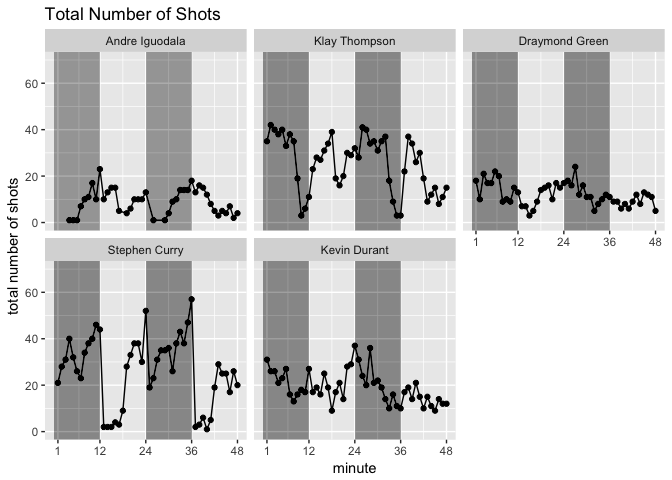
